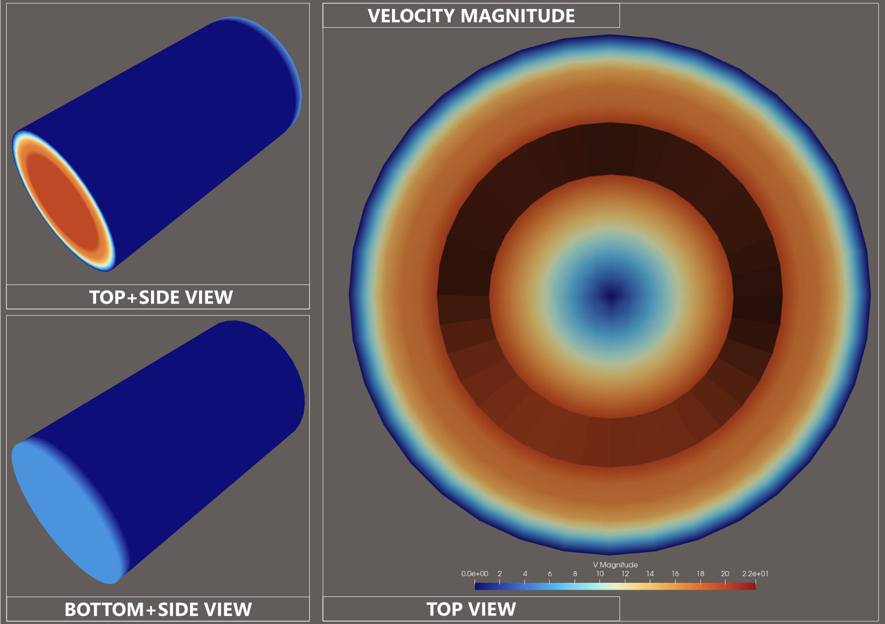
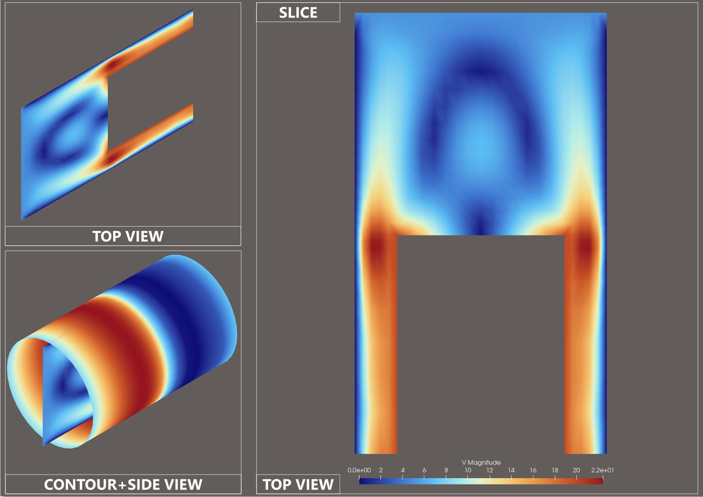
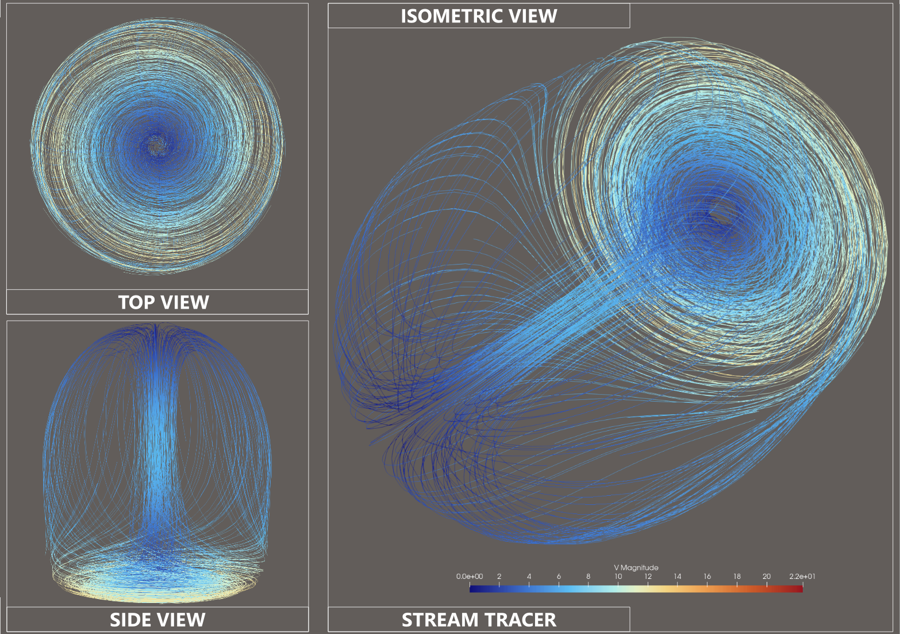
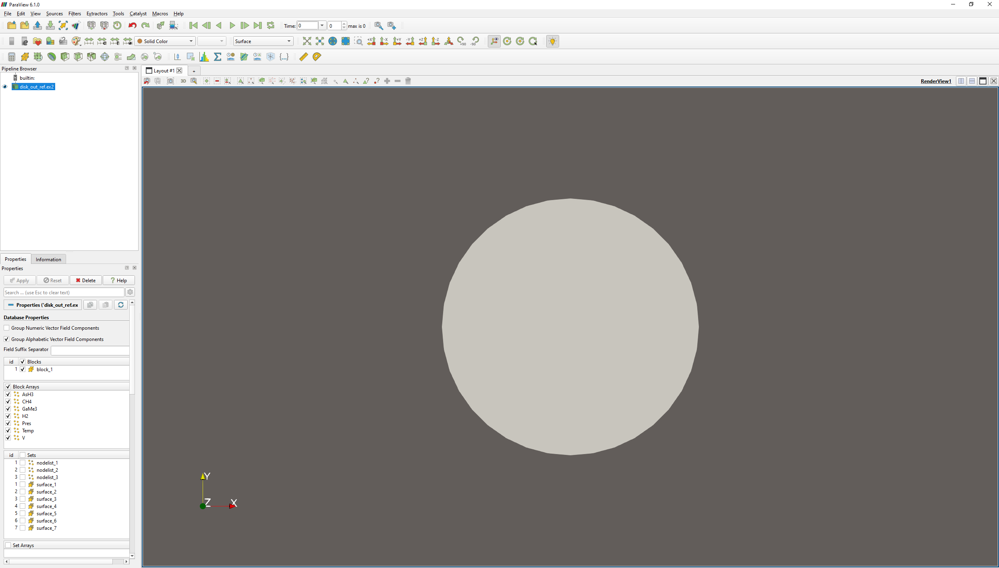
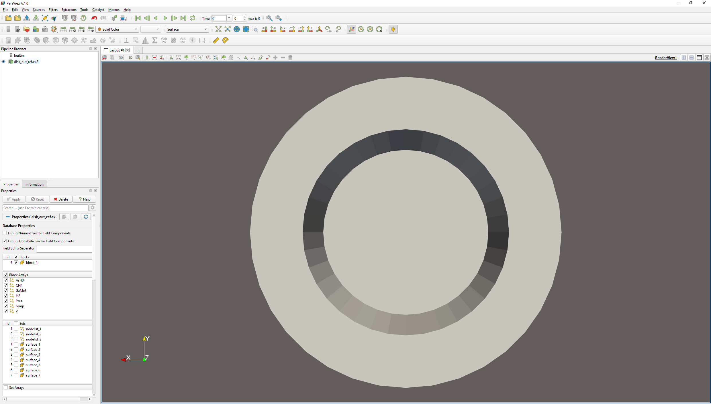
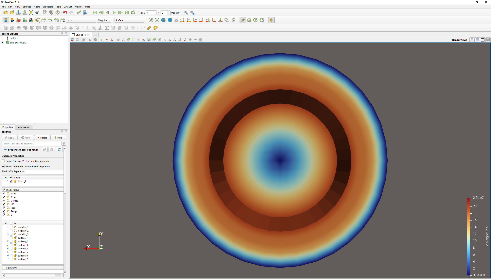
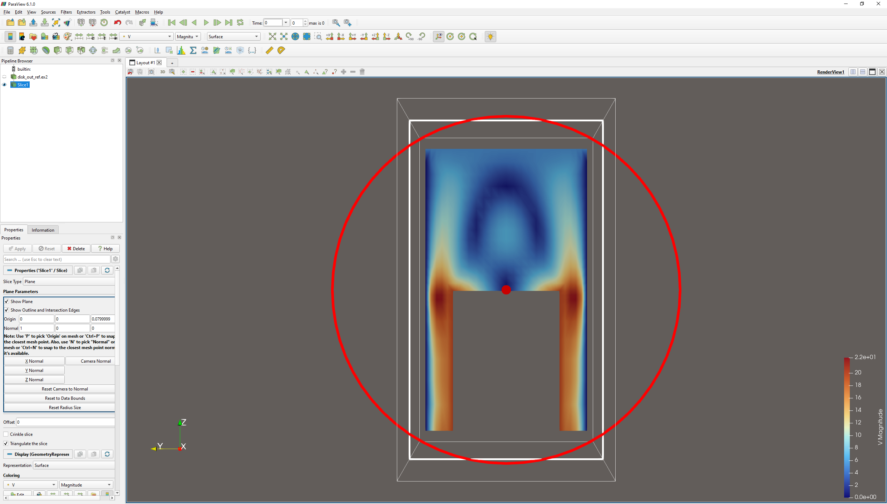
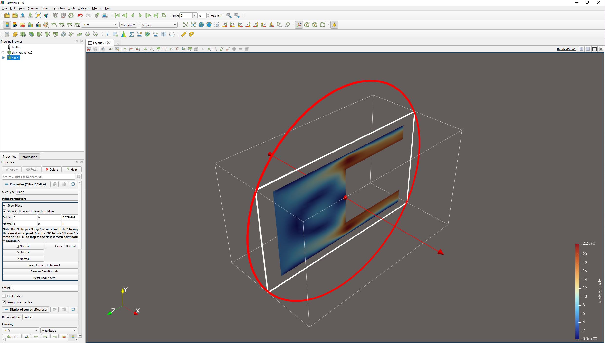
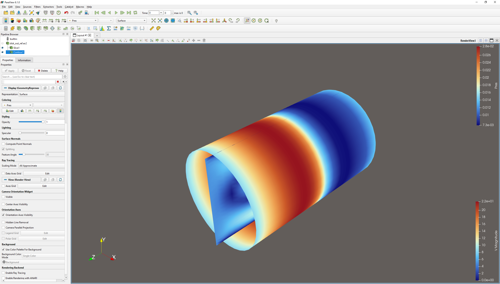
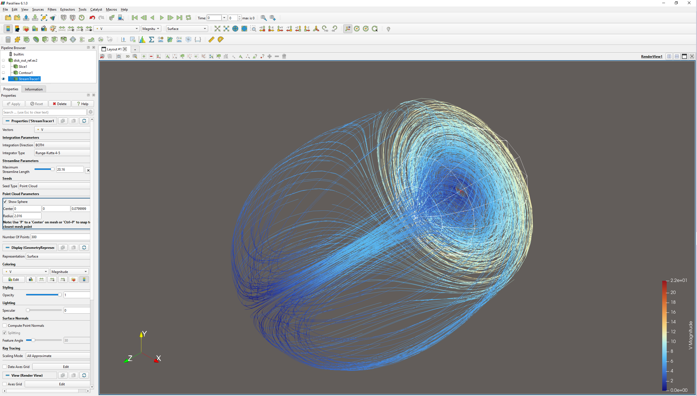

# ParaView Portfolio
Ryan DeJong | 6e2713977c88@handshakecommunity.ai

---

## Jump to section
- [Project 1: Refining Scientific Visualization Assets in ParaView](#project-1-refining-scientific-visualization-assets-in-paraview)
- [Featured final assets](#featured-final-assets)
- [Problem](#problem)
- [Objective](#objective)
- [Workflow](#workflow)
- [Outcome](#outcome)
- [AI relevance](#ai-relevance)
- [Supporting workflow visuals](#supporting-workflow-visuals)

---

## Project 1: Refining Scientific Visualization Assets in ParaView
**Tool:** ParaView  
**Dataset:** Official ParaView testing data, `disk_out_ref.ex2`

### Overview
This case study shows how a raw CFD dataset was transformed in ParaView into clearer scientific assets for AI-adjacent research workflows.

### Reading guide
The [Featured final assets](#featured-final-assets) section shows the completed deliverables first. The [Supporting workflow visuals](#supporting-workflow-visuals) section below documents how those final assets were developed in ParaView.

### Featured final assets

These final deliverables were selected because they most clearly improve technical interpretability over the default loaded view.

### Velocity-mapped visuals

This final collage combines the strongest top-facing velocity view with supporting side-angle context views. It was selected as a featured deliverable because it clearly communicates scalar variation while also showing the object’s 3D form in a more reviewer-friendly format.

### Slice-based internal inspection

This final collage combines the primary slice inspection view with supporting context views that clarify the slice geometry and its relationship to the surrounding pressure-colored structure. It was selected as a featured deliverable because it makes internal variation easier to inspect than the exterior-only views.

### Stream tracer refinement

This final collage combines isometric, top, and side views of the point-cloud stream tracer result. It was selected as a featured deliverable because it shows the flow structure from multiple angles while keeping the isometric view as the primary reviewer-facing image.

---

### Problem
The default loaded view of the dataset did not clearly reveal internal flow structure or variable patterns. In its initial state, the dataset was loaded correctly but was not yet strong enough for fast technical review.

### Objective
Create a compact set of scientific visualization outputs that improve interpretability by exposing:
- stronger variable visibility
- internal structure
- scalar-field comparison
- flow-path behavior

### Workflow
- Inspected the default loaded dataset view
- Reoriented the camera to improve feature visibility
- Applied velocity-based coloring to encode scalar variation
- Used slicing to inspect internal structure
- Used pressure contouring to compare a second scalar field
- Used a point-cloud stream tracer to make flow paths more explicit

### Outcome
The result is a small set of refined technical assets that better support review, comparison, and interpretation than the default loaded view alone.

### AI relevance
These outputs are relevant to AI-adjacent research workflows because refined scientific visualizations can support asset review, comparison, quality evaluation, and human-in-the-loop interpretation.

---

### Supporting workflow visuals

### 1. Initial dataset state
This screenshot shows the dataset in its default loaded state before refinement. It establishes the starting point of the case study, but it does not yet clearly communicate the internal structure or scientific variation needed for strong technical review.

### 2. Viewpoint refinement for feature visibility
The camera was reoriented to a stronger top-facing view so that variable structure became easier to see. This addressed the initial visibility problem and created a better foundation for later refinement steps.

### 3. Velocity-mapped view
This view applies the dataset’s `V` field for color mapping, turning neutral geometry into a more interpretable scientific visualization. This is the first major refinement step because it makes the field variation visible rather than leaving the dataset as a plain surface.

### 4. Slice-based internal inspection
This slice view cuts through the dataset to expose internal field variation that is not visible from the exterior alone. It is a stronger analytical view because it reveals structure inside the model rather than only on the outer shell.

### 5. Slice orientation context
This isometric view provides 3D context for the slice plane. It supports the main slice result by showing where the cut is positioned inside the geometry.

### 6. Pressure contour extraction
This contour view uses the `Pres` field to extract a second scalar-based result. It adds a comparison layer to the case study by showing how a different scientific variable can reveal a different structure than velocity coloring alone.

### 7. Stream tracer refinement
This stream tracer result uses a point-cloud seed setup to generate a fuller set of flow paths through the dataset. It is one of the strongest outputs in the project because it makes directional flow behavior more explicit and visually interpretable.

