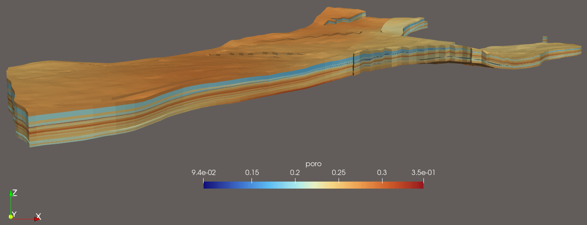
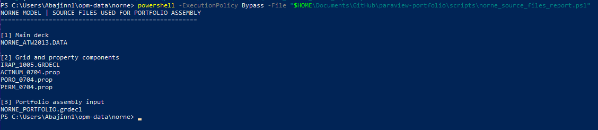
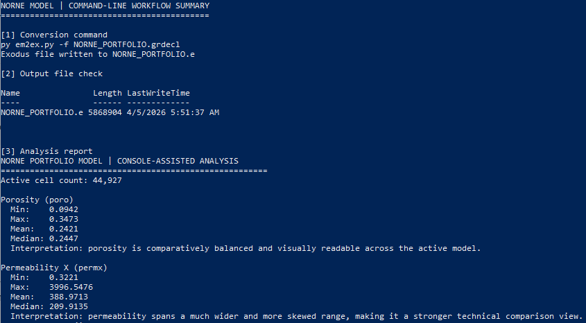
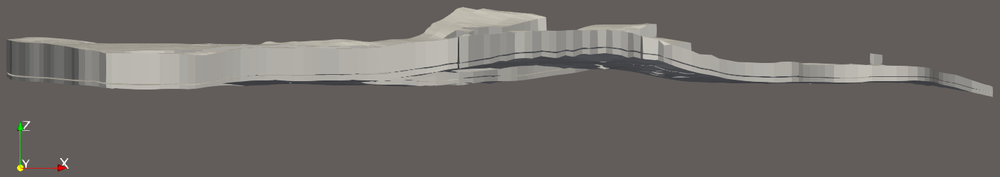
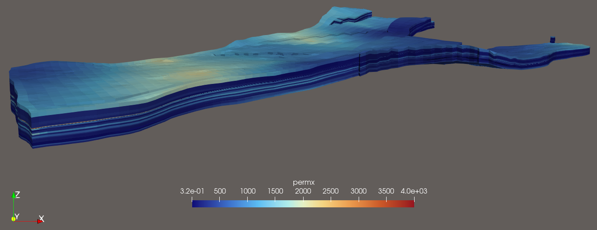
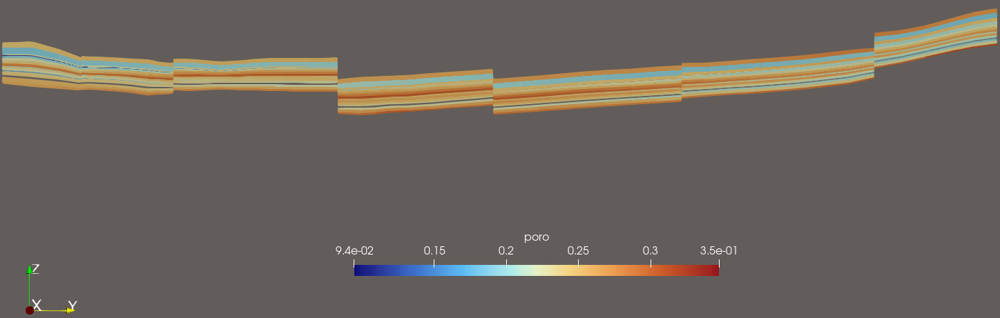
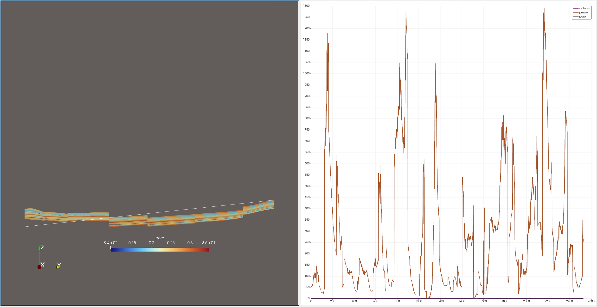

# Scientific Visualization Portfolio (ParaView)
Ryan DeJong | 6e2713977c88@handshakecommunity.ai

This portfolio presents reviewer-facing scientific visualization case studies built in ParaView using real technical datasets, command-line preprocessing workflows, and curated visual refinement. The focus is not just on loading data, but on converting raw scientific or engineering outputs into clearer digital assets for review, comparison, interpretation, and AI-adjacent evaluation workflows.

---

## Jump to section
- [Project 1: Reservoir Model Conversion and Property Refinement in ParaView](#project-1-reservoir-model-conversion-and-property-refinement-in-paraview)
- [Project 2: Refining Scientific Visualization Assets in ParaView](#project-2-refining-scientific-visualization-assets-in-paraview)

---

## Project 1: Reservoir Model Conversion and Property Refinement in ParaView
**Tools:** PowerShell, Python, `em2ex`, ParaView  
**Dataset:** Public Norne reservoir model components from the OPM data repository  
**Output format:** Exodus II (`.e`)

This case study shows how a public industrial-style reservoir model was assembled from multi-file Eclipse-style inputs, converted into Exodus II through a repeatable command-line workflow, and refined in ParaView into reviewer-friendly scientific assets showing structural geometry and reservoir property variation.

### Featured final asset

This final view was selected as the lead asset because it most clearly communicates the model’s layered subsurface structure, fault offsets, and property variation in a format that is fast to scan and strong for technical review.

<a href="assets/project1-norne/p1-05-norne-final-poro-view.png" target="_blank" rel="noopener noreferrer"></a>

### What this project demonstrates

This project demonstrates four things that are important in scientific visualization work. First, it uses a real public reservoir engineering dataset rather than a toy geometry. Second, it shows command-line model assembly and conversion rather than relying only on manual GUI work. Third, it uses ParaView to compare meaningful reservoir property fields on the same geological structure. Fourth, it pairs visual outputs with lightweight console-generated analysis to support interpretation of what the model is showing.

### Problem

Public reservoir models are often distributed as multi-file engineering inputs rather than as immediately reviewable visualization assets. In raw form, the source data is useful for simulation workflows, but not yet optimized for fast visual inspection, property comparison, or reviewer-facing interpretation in ParaView.

### Objective

Assemble a usable public reservoir model input, convert it into a ParaView-readable scientific format, and refine the result into a compact set of visual and analytical outputs that improve interpretability over the raw engineering inputs alone.

### Data source and model assembly

The source data for this project came from the public Norne reservoir case. Rather than arriving as a single ready-to-visualize file, the model was organized as multiple engineering components, including the structural grid, active-cell mask, porosity data, and permeability data. A small command-line assembly step was used to create a ParaView-oriented input file from those components before conversion.

<a href="assets/project1-norne/p1-02-norne-source-files-console.png" target="_blank" rel="noopener noreferrer"></a>

### Command-line workflow highlights

A command-line workflow was used to streamline model preparation and make the conversion process repeatable. This reduced reliance on manual file handling and made it easier to move from public engineering inputs to ParaView-ready scientific assets.

```powershell
@"
SPECGRID
46 112 22 1 F /
INCLUDE
./INCLUDE/GRID/IRAP_1005.GRDECL /
INCLUDE
./INCLUDE/GRID/ACTNUM_0704.prop /
INCLUDE
./INCLUDE/PETRO/PORO_0704.prop /
INCLUDE
./INCLUDE/PETRO/PERM_0704.prop /
"@ | Set-Content .\NORNE_PORTFOLIO.grdecl
```

This assembly step created a compact visualization-oriented input from the public grid and property components.

```powershell
py em2ex.py -f NORNE_PORTFOLIO.grdecl
```

This conversion step produced a ParaView-readable Exodus II file from the assembled Eclipse-style reservoir input.

<a href="assets/project1-norne/p1-03-norne-command-line-workflow-and-analysis.png" target="_blank" rel="noopener noreferrer"></a>

### Initial loaded state

This screenshot shows the converted reservoir model after loading in ParaView before property-based refinement. The structural geometry is already substantial, but the default presentation does not yet communicate reservoir properties or provide the strongest reviewer-facing view.

<a href="assets/project1-norne/p1-04-norne-initial-loaded-view.png" target="_blank" rel="noopener noreferrer"></a>

### Final curated property views

#### Porosity view (`poro`)

This final view was selected as the primary reviewer-facing asset because porosity variation is visually readable while still preserving the model’s geological structure. The result clearly shows layered subsurface variation and faulted geometry in a way that is easier to interpret quickly than the raw loaded model.

<a href="assets/project1-norne/p1-05-norne-final-poro-view.png" target="_blank" rel="noopener noreferrer"></a>

#### Permeability view (`permx`)

This view uses permeability in the x direction to show a second engineering property on the same reservoir structure. Compared with the porosity view, it reads as more technical and more simulation-oriented, making it a useful comparison asset for reviewer-facing interpretation.

<a href="assets/project1-norne/p1-06-norne-final-permx-view.png" target="_blank" rel="noopener noreferrer"></a>

#### Internal structure inspection

This slice view isolates a thin cross-section through the reservoir model to expose internal layering and fault-related offsets that are less obvious from the exterior surface alone. It was included as an interpretation view rather than a hero image, because its value is diagnostic: it reveals internal structure and property continuity across the model thickness.

<a href="assets/project1-norne/p1-07-norne-clip-or-slice-view.png" target="_blank" rel="noopener noreferrer"></a>

### Console-assisted analysis

The visual outputs were paired with lightweight console-generated analysis so the selected views were supported by the underlying scalar data rather than chosen on appearance alone. This made it easier to compare property fields and explain why certain views were stronger for reviewer-facing use.

The converted model contains **44,927 active cells**.

For `poro`, the extracted values are comparatively balanced and visually readable across the active model:
- Min: `0.0942`
- Max: `0.3473`
- Mean: `0.2421`
- Median: `0.2447`

For `permx`, the extracted values span a much wider and more skewed range, which makes it a stronger technical comparison view:
- Min: `0.3221`
- Max: `3996.5476`
- Mean: `388.9713`
- Median: `209.9135`

### Slice-linked line sampling

This view pairs an internal `poro` slice with a sampled line profile to connect visual structure to extracted quantitative behavior. The cross-section exposes internal layering and fault offsets, while the accompanying plot shows how sampled values vary along the selected path through the model.

<a href="assets/project1-norne/p1-09-norne-slice-plus-plot-over-line-analysis.png" target="_blank" rel="noopener noreferrer"></a>

### Why these views were selected

The final views were selected to balance readability, technical depth, and reviewer scanability. The porosity view was chosen as the strongest lead asset because it makes geological structure and scalar variation easy to read together. The permeability view was chosen as the strongest technical comparison because it presents a second reservoir property on the same structure. The slice view was selected to show that the workflow included interpretation of the model interior rather than exterior rendering alone.

### AI-adjacent relevance

This workflow is relevant to AI-adjacent scientific asset development because it combines repeatable command-line preprocessing, structured technical visualization, and compact numeric interpretation. Outputs like these can support digital-asset review, comparison, labeling, quality evaluation, and human-in-the-loop interpretation workflows in scientific or engineering contexts.

### Outcome

The result is a stronger reviewer-facing case study built from a real public reservoir model rather than a toy dataset. It demonstrates command-line model preparation, format conversion, ParaView-based property refinement, and visual analysis grounded in the underlying scalar data.

---

## Project 2: Refining Scientific Visualization Assets in ParaView
**Tool:** ParaView  
**Dataset:** Official ParaView testing data, `disk_out_ref.ex2`

### Overview

This case study shows how a raw CFD dataset was transformed in ParaView into clearer scientific assets for AI-adjacent research workflows.

### Reading guide

The featured final assets section shows the completed deliverables first. The supporting workflow visuals section below documents how those final assets were developed in ParaView.

### Featured final assets

These final deliverables were selected because they most clearly improve technical interpretability over the default loaded view.

### Velocity-mapped visuals

This final collage combines the strongest top-facing velocity view with supporting side-angle context views. It was selected as a featured deliverable because it clearly communicates scalar variation while also showing the object’s 3D form in a more reviewer-friendly format.

<a href="assets/10-final-velocity-collage.png" target="_blank" rel="noopener noreferrer"></a>

### Slice-based internal inspection

This final collage combines the primary slice inspection view with supporting context views that clarify the slice geometry and its relationship to the surrounding pressure-colored structure. It was selected as a featured deliverable because it makes internal variation easier to inspect than the exterior-only views.

<a href="assets/12-final-slice-collage.png" target="_blank" rel="noopener noreferrer"></a>

### Stream tracer refinement

This final collage combines isometric, top, and side views of the point-cloud stream tracer result. It was selected as a featured deliverable because it shows the flow structure from multiple angles while keeping the isometric view as the primary reviewer-facing image.

<a href="assets/09-final-stream-tracer-collage.png" target="_blank" rel="noopener noreferrer"></a>

### Problem

The default loaded view of the dataset did not clearly reveal internal flow structure or variable patterns. In its initial state, the dataset was loaded correctly but was not yet strong enough for fast technical review.

### Objective

Create a compact set of scientific visualization outputs that improve interpretability by exposing:
- stronger variable visibility
- internal structure
- scalar-field comparison
- flow-path behavior

### Workflow

- Inspected the default loaded dataset view
- Reoriented the camera to improve feature visibility
- Applied velocity-based coloring to encode scalar variation
- Used slicing to inspect internal structure
- Used pressure contouring to compare a second scalar field
- Used a point-cloud stream tracer to make flow paths more explicit

### Outcome

The result is a small set of refined technical assets that better support review, comparison, and interpretation than the default loaded view alone.

### AI relevance

These outputs are relevant to AI-adjacent research workflows because refined scientific visualizations can support asset review, comparison, quality evaluation, and human-in-the-loop interpretation.

### Supporting workflow visuals

#### 1. Initial dataset state

This screenshot shows the dataset in its default loaded state before refinement. It establishes the starting point of the case study, but it does not yet clearly communicate the internal structure or scientific variation needed for strong technical review.

<a href="assets/01-raw-dataset-view.png" target="_blank" rel="noopener noreferrer"></a>

#### 2. Viewpoint refinement for feature visibility

The camera was reoriented to a stronger top-facing view so that variable structure became easier to see. This addressed the initial visibility problem and created a better foundation for later refinement steps.

<a href="assets/02-raw-dataset-plus-Z-view.png" target="_blank" rel="noopener noreferrer"></a>

#### 3. Velocity-mapped view

This view applies the dataset’s `V` field for color mapping, turning neutral geometry into a more interpretable scientific visualization. This is the first major refinement step because it makes the field variation visible rather than leaving the dataset as a plain surface.

<a href="assets/02-colored-by-velocity.png" target="_blank" rel="noopener noreferrer"></a>

#### 4. Slice-based internal inspection

This slice view cuts through the dataset to expose internal field variation that is not visible from the exterior alone. It is a stronger analytical view because it reveals structure inside the model rather than only on the outer shell.

<a href="assets/04-slice-plus-x-view.png" target="_blank" rel="noopener noreferrer"></a>

#### 5. Slice orientation context

This isometric view provides 3D context for the slice plane. It supports the main slice result by showing where the cut is positioned inside the geometry.

<a href="assets/05-slice-isometric-view.png" target="_blank" rel="noopener noreferrer"></a>

#### 6. Pressure contour extraction

This contour view uses the `Pres` field to extract a second scalar-based result. It adds a comparison layer to the case study by showing how a different scientific variable can reveal a different structure than velocity coloring alone.

<a href="assets/06-pressure-contour-isometric.png" target="_blank" rel="noopener noreferrer"></a>

#### 7. Stream tracer refinement

This stream tracer result uses a point-cloud seed setup to generate a fuller set of flow paths through the dataset. It is one of the strongest outputs in the project because it makes directional flow behavior more explicit and visually interpretable.

<a href="assets/07-stream-tracer-point-cloud.png" target="_blank" rel="noopener noreferrer"></a>